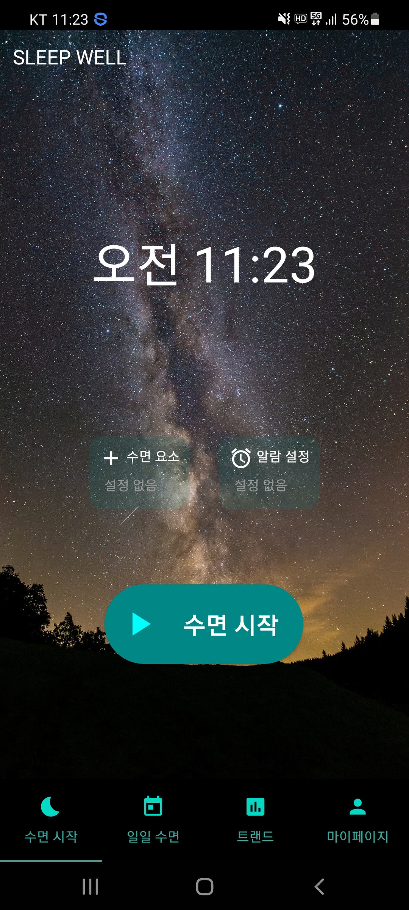
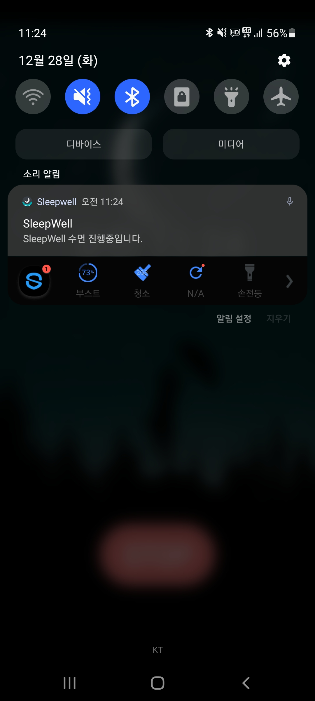
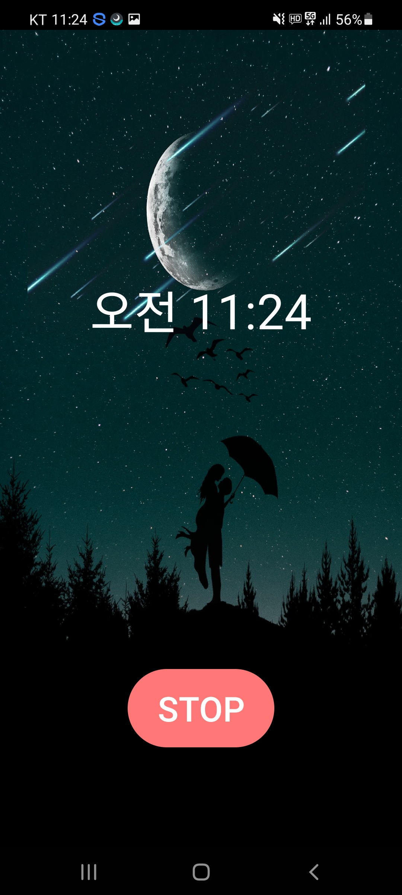
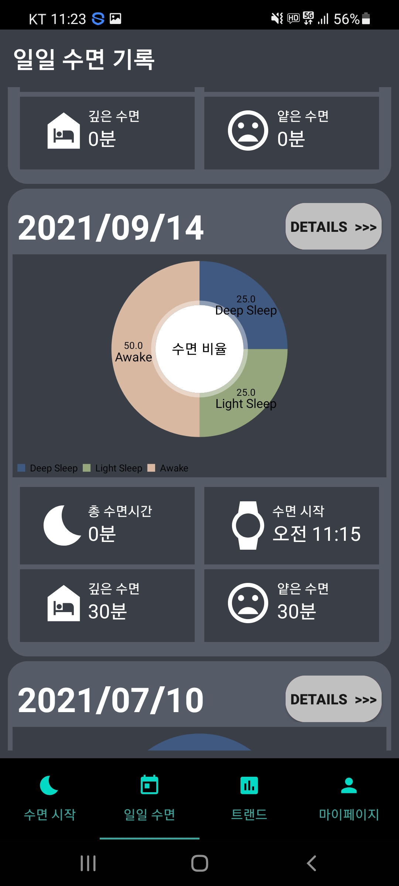
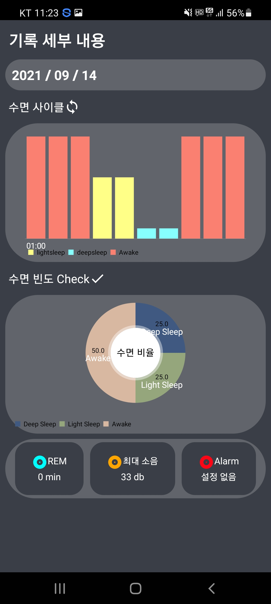
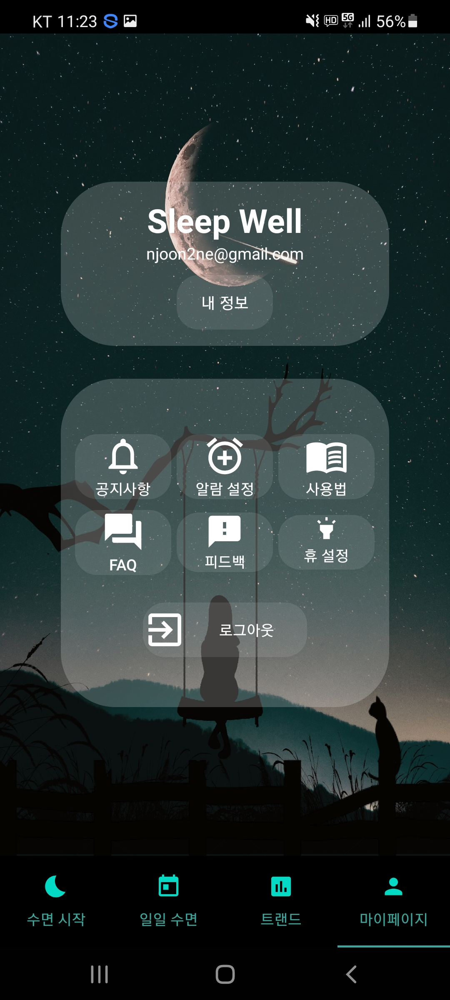

<div align="center">

# 🌙 Sleep Well

> 당신의 수면을 기록하고 분석해주는 스마트 수면 관리 앱


</div>

---

## 🎓 프로젝트 정보

| 항목 | 내용 |
|------|------|
| **과정** | KPUCE Capstone Project 2021 |
| **분류** | 수면 관리 어플리케이션 (Sleep Management Application) |

### 🎯 설계 목적
사용자의 수면 데이터 분석을 통해 수면 정보를 확인하고 가이드를 제공하는 **수면 트래킹 어플리케이션** 개발

### 👥 팀 구성

| 이름 | 역할 |
|------|------|
| 이풍훈 | 리더 / 수면 알고리즘 개발 |
| 조남준 | Firebase 연동 및 UI 개발 |
| 김동윤 | 휴(Hue) 연동 모듈 개발 |

---

## 📱 소개

**Sleep Well**은 사용자의 수면 패턴을 실시간으로 감지하고 기록하여,  
깊은 수면 / 얕은 수면 / 깨어있는 상태를 분석해주는 Android 수면 관리 애플리케이션입니다.

---

## ✨ 주요 기능

### 🛏️ 수면 시작
- **수면 요소** 및 **알람 설정** 후 수면 시작
- 수면 시작과 동시에 배경화면이 수면 모드로 전환
- 상단 알림바에 수면 진행 상태 표시
- **STOP** 버튼으로 수면 종료

### 📊 일일 수면 기록
- 날짜별 수면 기록 목록 조회
- **깊은 수면 / 얕은 수면 / 깨어있는 시간** 요약 제공
- 도넛 차트로 수면 비율 시각화
- **DETAILS** 버튼으로 상세 기록 확인

### 🔍 기록 세부 내용
- 수면 사이클 **바 차트** 시각화 (lightsleep / deepsleep / Awake)
- 수면 비율 **도넛 차트**
- **REM** 수면 시간, 최대 소음(db), 알람 정보 확인

### 👤 마이페이지
- 사용자 정보 확인 및 내 정보 관리
- 공지사항 / 알람 설정 / 사용법 안내
- FAQ / 피드백 / 휴 설정
- 로그아웃

---

## 📸 스크린샷

| 메인 화면 | 수면 진행 중 | 수면 진행 중 (알림) |
|:---------:|:----------:|:------------------:|
|  |  |  |
| 수면 시작 버튼 및 설정 | 수면 모드 화면 + STOP | 상단 알림바 표시 |

| 일일 수면 기록 | 기록 세부 내용 | 마이페이지 |
|:-------------:|:------------:|:---------:|
|  |  |  |
| 날짜별 수면 요약 | 수면 사이클 차트 | 설정 및 계정 관리 |

---

## 🗂️ 화면 구성

```
📱 Sleep Well
├── 🌙 수면 시작      - 수면 요소 설정, 알람 설정, 수면 시작/종료
├── 📅 일일 수면      - 날짜별 수면 기록 및 차트 요약
├── 📈 트랜드         - 수면 트랜드 분석
└── 👤 마이페이지     - 계정 정보, 설정, 공지사항
```

---

## 🛠️ 기술 스택


---

## 📧 Contact

- **Email** : njoon2ne@gmail.com

</div>
